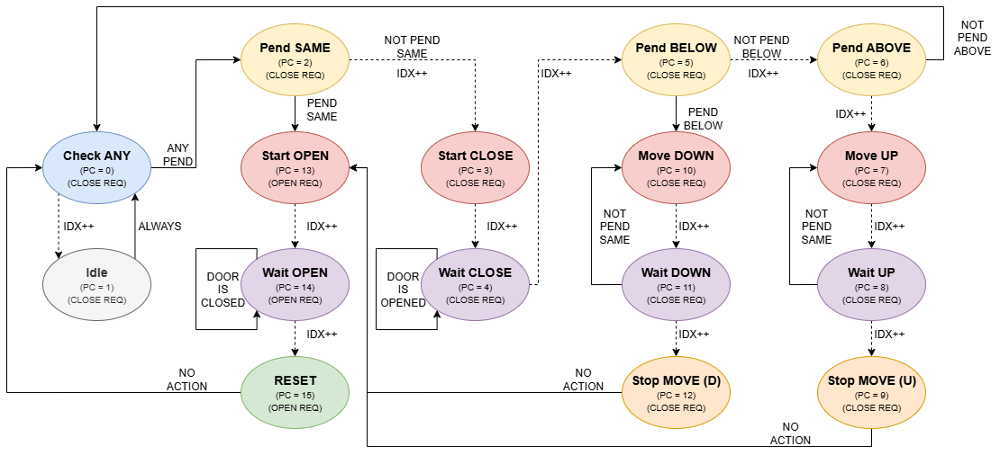

# Elevator Emulator

A minimalistic, safe, and fully testable **elevator controller emulator** written in standard C.  
Implements a microcoded state machine with programmable logic and condition selector evaluation, along with extensive test infrastructure.

---

## Features

- 6-floor elevator simulation
- 256-word microcoded instruction memory
- Condition selector logic via `CondSel_calc`
- Safe instruction decoder & executor (`SeqNet_loop`)
- Logging & debugging for each simulation step
- 10 unit tests for condition selector
- 10 unit tests for instruction logic
- 13 full end-to-end functional elevator test cases
- Git version info embedded at runtime
- No dynamic memory usage
- No external dependencies

## Documentation

Fully generated Doxygen based documentation available here:
[HTML documentation](https://github.com/siposroland/ElevatorEmulator/blob/main/docs/html/index.html)

You can regenerate the documentation with the following command
```bash
doxygen .\Doxyfile
```

Default style guide: 
[Style Guide](https://github.com/siposroland/ElevatorEmulator/blob/main/STYLEGUIDE.md)

## Firmware state machine

---

## Build Instructions

### Requirements

- Windows OS (tested on	Microsoft Windows 11 Pro 10.0.26100 Build 26100)
- `gcc` compiler (tested with MinGW on Windows)
- Git (to embed commit hash in build)
- Doxygen (to document as a HTML)

Please find the details in here!
[MINGW W64 - WinLibs](https://www.mingw-w64.org/downloads/#winlibscom)

### Build via CLI

```bash
mingw32-make.exe
```

---

## Run

```bash
./build/lift_emulator.exe
```

Sample output included test logs, memory dumps, and PASS status for all test cases.
```bash
Hello, Elevator Emulator!
Version: v0.1.0
Git hash: ba69560

[TEST] Running CondSel_calc() test cases...
  - Pending below only, index=1              ... OK
  - Door open, index=5                       ... OK
  ...
[TEST] 10/10 tests passed.

[TEST] Running SeqNet_loop() test cases...
  - Move up only                             ... OK
  - Door open only                           ... OK
  ...
[TEST] 10/10 tests passed.

Test case: open_door_same_floor
INT: Floor: 2, Door Open: Y, Moving: N, Calls: [0, 0, 1, 0, 0, 0], PC preset: 0
END: Floor: 2, Door Open: Y, Moving: N, Calls: [0, 0, 0, 0, 0, 0]
Test case PASSED!
...
```

---

## Functional Test Cases

Found in: `test_lift.c`

### Current scenarios tested:
- Door reopening
- Moving up or down one or more floors
- Resetting calls
- Handling multiple simultaneous calls
- Idling when no request
- Call resolution from bottom to top
- and so on ...

All 13 test cases **pass successfully** with full step-by-step debug logs.

---

##  Safety

- Never allows movement **below floor 0** or **above floor 5**
- Door **never opens while moving**
- Up/Down movement only valid when requests exist
- All instructions validated by unit tests
- All condition checks routed through `CondSel_calc()`
- Instruction jump conditions handle both `cond_sel` and `cond_inv`
- Test case validation with ProgMem Firwmare Lift Tester
- Assertions via `LIFT_ASSERT()` prevent illegal state
- No dynamic memory or heap operations are used

---

## Version & Metadata

- Version: `v1.0.0`
- Git hash: `0e41fd819e6c0906f174579cd6171997e155e6b7`
- Git info is injected at build time via macro

---

## Possible Future Plans

- Optimization of the firmware (suboptimal states)
- Raylib-based visual GUI mode (planned via `USE_GUI` switch)
- Manual interactive simulation (keyboard-controlled floor buttons)
- Dynamic instruction loading (from file or external flash)
- Integration with real microcontroller or embedded target
- Export test results in CSV/HTML

---

## License

MIT License  
(c) 2025 Roland Sipos  
This project is provided for demonstration, testing, and educational purposes.